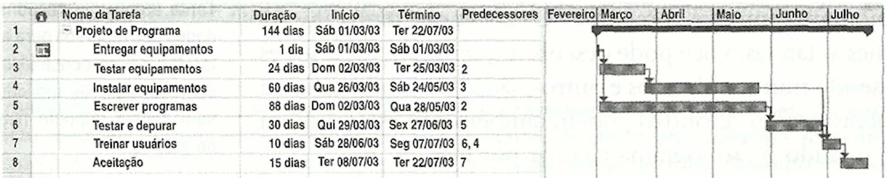

# Especificações do Projeto

Pré-requisitos: <a href="1-Documentação de Contexto.md"> Documentação de Contexto</a>

Definição do problema e ideia de solução a partir da perspectiva do usuário. É composta pela definição do  diagrama de personas, histórias de usuários, requisitos funcionais e não funcionais além das restrições do projeto.

Apresente uma visão geral do que será abordado nesta parte do documento, enumerando as técnicas e/ou ferramentas utilizadas para realizar a especificações do projeto

## Personas

|Sabrina Nonato  |         **Idade:** 29 Anos                 |     **Educação:** Graduado em Analise e Desenvolvimento de Sistemas   |
|--------------------|------------------------------------|----------------------------------------|
|  | **Motivaçoes:** Saber os benefícios dos alimentos, ter o controle de consumo de água, lembrete dos horários das refeições |**Frustaçoes:** Desafio em conquistar mercado e atrair clientes para varejo de alimentos diante da conveniência e variedade das grandes empresas. |
|**Hobbies:** Artesanato, leitura, yoga, caminhadas, fotografia, culinária, |**Localização:** Juiz de Fora - Minas Gerais   |**Área:** Suporte de E - Commerce  |

|Francisco Cunha  |       **Idade:** 56 Anos               |     **Educação:** Graduação em Administração de Empresas    |
|--------------------|------------------------------------|----------------------------------------|
|  | **Motivaçoes:** Desafio em conquistar clientes e se destacar no mercado de comida típica, frente à conveniência e variedade oferecidas pelas grandes redes de alimentação. |**Frustaçoes:** Concorrência desafiadora de grandes redes varejistas de alimentos, e suas plataformas online, que possuem recursos financeiros superiores, apesar dos esforços em qualidade e serviço personalizado da Uai Food. |
|**Hobbies:** Cozinhar, explorar novos sabores, ler sobre gastronomia e produtos orgânicos. |**Localização:** Belo Horizonte - Minas Gerais |**Área:** Proprietário de varejo de um mercado de alimentos, especializado em produtos gourmet e orgânicos.  |

|João Dos Santos  |   **Idade:** 31 Anos           |**Educação:** Graduado em Educação Física.|
|--------------------|------------------------------------|----------------------------------------|
|  | **Motivaçoes:** Desfrutar do sabor autêntico da comida típica mineira, mantendo o físico saudável e aprimorando a qualidade de vida. |**Frustaçoes:** Lamento profundo pela falta de comida mineira autêntica no restaurante |
|**Hobbies:** Explorar receitas culinárias e assistir séries de comida para se divertir e relaxar, combinando paixão por gastronomia e entretenimento.  |**Localização:** Sete Lagoas - Minas Gerais |**Área:** Atuação em treinamento físico e condicionamento físico.|

|Laura Mendes |         **Idade:** 27 Anos   |     **Educação:** Graduado em Fotografia         |
|--------------------|------------------------------------|----------------------------------------|
|  | **Motivaçoes:** Explorar os sabores autênticos da culinária mineira e apreciar a conveniência de personalizar seus pedidos por meio do aplicativo do restaurante, a fim de otimizar seu tempo e desfrutar de refeições feitas sob medida.| **Frustaçoes:** Não ter muito tempo para desfrutar tranquilamente de uma refeição no restaurante e acabar recorrendo a opções rápidas|
|**Hobbies:**  Fotografia gastronômica e experimentação culinária. |**Localização:** Buritis - Minas Gerais   |**Área:** Atua profissionalmente como fotógrafa autônoma  |

|Davi Oliver  |         **Idade:** 27 Anos             |     **Educação:** Estudante de Medicina em uma universidade renomada.        |
|--------------------|------------------------------------|----------------------------------------|
|  | **Motivaçoes:** Recém-chegado a Minas, busca explorar e se encantar pela comida mineira enquanto se dedica aos estudos de medicina. |**Frustaçoes:** Com pouco tempo disponível devido aos estudos intensivos, enfrenta dificuldades para desfrutar tranquilamente da comida mineira que tanto ama.|
**Hobbies:** Dedica seu tempo livre à leitura, mergulhando em diferentes gêneros literários para relaxar e expandir seus horizontes.|**Localização:**  Nova Lima - Minas Gerais |**Área:** Área acadêmica voltada para a pesquisa em neurologia. |

## Histórias de Usuários

Com base na análise das personas forma identificadas as seguintes histórias de usuários:

|EU COMO... `PERSONA`| QUERO/PRECISO ... `FUNCIONALIDADE` |PARA ... `MOTIVO/VALOR`                 |
|--------------------|------------------------------------|----------------------------------------|
|Francisco Cunha, Empresário  | Efetuar o pedido do cliente, usando o sistema do restaurante.   | Atender o cliente seguindo as diretrizes da cozinha e da gestão, utilizando a mesma base de dados, garantindo a conformidade com as regras de negócio. |
|Davi Oliver,Universitário | Comprar online e retirar meu pedido quando ele já estiver pronto  | Desfrutar de refeições frescas sem a necessidade de prepará-las pessoalmente. |
| Davi Oliver, Universitário  | Quero conhecer mais sobre o restaurante, sua história e os pratos oferecidos antes de decidir fazer um pedido | Para fazer uma escolha consciente e segura antes de comprar online no restaurante |
|Laura Mendes, Fotógrafa | Ter a opção de pagar diretamente pelo aplicativo do restaurante | Agilizar o processo de compra e proporcionar maior comodidade. |
|Laura Mendes, Fotógrafa | Aproveitar ofertas exclusivas e descontos especiais ao fazer pedidos pelo aplicativo do restaurante.| Para economizar dinheiro e desfrutar de vantagens exclusivas ao pedir através do aplicativo do restaurante de comida mineira|
|João Dos Santos, Professor | Uma opção de personalizar meu pedido através do aplicativo do restaurante |Buscas uma experiência gastronômica adaptada às suas preferências individuais. |

Apresente aqui as histórias de usuário que são relevantes para o projeto de sua solução. As Histórias de Usuário consistem em uma ferramenta poderosa para a compreensão e elicitação dos requisitos funcionais e não funcionais da sua aplicação. Se possível, agrupe as histórias de usuário por contexto, para facilitar consultas recorrentes à essa parte do documento.

## Modelagem do Processo de Negócio 

### Análise da Situação Atual

Apresente aqui os problemas existentes que viabilizam sua proposta. Apresente o modelo do sistema como ele funciona hoje. Caso sua proposta seja inovadora e não existam processos claramente definidos, apresente como as tarefas que o seu sistema pretende implementar são executadas atualmente, mesmo que não se utilize tecnologia computacional. 

### Descrição Geral da Proposta

Apresente aqui uma descrição da sua proposta abordando seus limites e suas ligações com as estratégias e objetivos do negócio. Apresente aqui as oportunidades de melhorias.

### Processo 1 – NOME DO PROCESSO

Apresente aqui o nome e as oportunidades de melhorias para o processo 1. Em seguida, apresente o modelo do processo 1, descrito no padrão BPMN. 

### Processo 2 – NOME DO PROCESSO

Apresente aqui o nome e as oportunidades de melhorias para o processo 2. Em seguida, apresente o modelo do processo 2, descrito no padrão BPMN.

## Indicadores de Desempenho

Apresente aqui os principais indicadores de desempenho e algumas metas para o processo. Atenção: as informações necessárias para gerar os indicadores devem estar contempladas no diagrama de classe. Colocar no mínimo 5 indicadores. 

Usar o seguinte modelo: 

Obs.: todas as informações para gerar os indicadores devem estar no diagrama de classe a ser apresentado a posteriori. 

## Requisitos

As tabelas que se seguem apresentam os requisitos funcionais e não funcionais que detalham o escopo do projeto. Para determinar a prioridade de requisitos, aplicar uma técnica de priorização de requisitos e detalhar como a técnica foi aplicada.

### Requisitos Funcionais

|ID    | Descrição do Requisito  | Prioridade |
|------|-----------------------------------------|----|
|RF-001| O perfil Adm, precisa ser capaz de editar as informações do site . | ALTA | 
|RF-002| O perfil adm só está disponivel na versão WEB   | ALTA  |]
|RF-003| Os usuários devem ser capazes de selecionar os alimentos a partir de um banco de dados. | ALTA  |
|RF-004| A aplicação deve oferecer a opção de realizar pedidos online para entrega em domicílio ou retirada no local | ALTA  |
|RF-005| Integrar métodos de pagamento seguros para que os clientes possam pagar pelos pedidos online de forma conveniente. | ALTA  |
|RF-006| Fornecer informações detalhadas sobre o restaurante, como horário de funcionamento, localização, informações de contato e um breve histórico ou descrição da culinária oferecida. | BAIXA  |
|RF-007| Disponibilizar um sistema de suporte técnico e atendimento ao cliente eficiente para ajudar os clientes com quaisquer dúvidas, problemas técnicos ou questões relacionadas aos pedidos. |MÉDIA  |
|RF-008| Ter uma seção dedicada a listar eventos especiais, promoções sazonais e ofertas exclusivas para incentivar os clientes a retornarem ao restaurante. | MÉDIA|
|RF-009| O usuario irá receber uma notificação sobre o status do seu pedido  | MÉDIA|
|RF-010| A aplicação deve perimiti ao usúario a possibilidade de personalizar os pedidos de acordo com sua preferências.| MÉDIA |
|RF-011| O ADM poderá alterar os staus do pedido  | BAIXA|
|RF-012| O usuario poderá fazer um cadastro no sistema  | ALTA |
|RF-013| O usuario poderá fazer fazer alteração dos seus dados no sistema | ALTA |
|RF-014| O perfil adm só está disponivel na versão WEB | ALTA |
|RF-015| O adm conseguirá altera o status dos produtos como: disponivel e indisponivel | ALTA |

### Requisitos não Funcionais

|ID     | Descrição do Requisito  |Prioridade |
|-------|-------------------------|----|
|RNF-001| A interface de aplicação deve ser fácil de usar, com layouts claros e navegação lógica. | MÉDIA | 
|RNF-002| O aplicativo deve ser acessível para pessoas com deficiências visuais, motoras ou auditivas. |  ALTA |
|RNF-003| O aplicativo deve ser compatível com o sistema operacional Android. | ALTA |
|RNF-004| O sistema utilizará uma API Externa para auxílio no banco de dados. | ALTA |
|RNF-005| Será utilizada  as seguintes tecnologias: React-native, Java-script,CSS, HTML, Flask, PostgresSQL, C++, C#, JAVA. | MÉDIA |
|RNF-006| Certificar-se de que o site seja compatível com uma ampla variedade de navegadores da web (Chrome, Firefox, Safari, etc.) e dispositivos (desktops, laptops, tablets, smartphones), garantindo uma experiência consistente em diferentes plataformas. | ALTA |
|RNF-006| O sistema do restaurante deve estar disponível e acessível aos clientes durante o horário comercial. Isso envolve garantir que o site esteja online, os sistemas de reservas funcionem corretamente e os pedidos online sejam processados sem interrupções. | ALTA |

## Restrições

O projeto está restrito pelos itens apresentados na tabela a seguir.

|ID| Restrição                                             |
|--|-------------------------------------------------------|
|01| Não roda em IOS |
|02| O sistema não irá fornecer o acompanhamento da entrega   |
|03| O projeto deverá ser entregue até o final do semestre |
|04| A equipe não pode subcontratar o desenvolvimento do trabalho|
|05| A platarma se compromete em não compartlhar histórico de pesquisa, lacalização em tempo real e dados sensiveis|
|06| O projeto do site deve ser desenvolvido dentro de um orçamento definido para evitar custos excessivos.|

## Diagrama de Casos de Uso

# Matriz de Rastreabilidade

A matriz de rastreabilidade pode ser usada para ajudar a garantir que todos os requisitos estejam sendo atendidos e testados adequadamente, e para identificar quais partes do sistema podem ser afetadas por alterações em um requisito específico. A matriz será atualizada à medida que o sistema evolui e novas relações são identificadas.

Nesta matriz, cada linha representa um Requisito Não Funcional/Caso de Teste e cada coluna representa um Requisito Funcional/Caso de Teste. A interseção entre uma linha e uma coluna é marcada com um “X” se o requisito não funcional correspondente à linha afeta o requisito funcional correspondente à coluna. Por exemplo, a interseção entre a linha “RNF-001” e a coluna “RF-001” é marcada com um “X”, indicando que o Requisito Não Funcional “RNF-001” (Usabilidade: o aplicativo deve ter uma interface intuitiva, com botões bem definidos e fácil navegação) afeta o Requisito Funcional “RF-001” (O aplicativo deve permitir que o usuário realize o cadastro). Para os Casos de Testes que está implementado na matriz, o sistema funciona seguindo o mesmo padrão com o X marcando uma interseção em um RNF ou RF.

# Gerenciamento de Projeto

De acordo com o PMBoK v6 as dez áreas que constituem os pilares para gerenciar projetos, e que caracterizam a multidisciplinaridade envolvida, são: Integração, Escopo, Cronograma (Tempo), Custos, Qualidade, Recursos, Comunicações, Riscos, Aquisições, Partes Interessadas. Para desenvolver projetos um profissional deve se preocupar em gerenciar todas essas dez áreas. Elas se complementam e se relacionam, de tal forma que não se deve apenas examinar uma área de forma estanque. É preciso considerar, por exemplo, que as áreas de Escopo, Cronograma e Custos estão muito relacionadas. Assim, se eu amplio o escopo de um projeto eu posso afetar seu cronograma e seus custos.

## Gerenciamento de Tempo

Com diagramas bem organizados que permitem gerenciar o tempo nos projetos, o gerente de projetos agenda e coordena tarefas dentro de um projeto para estimar o tempo necessário de conclusão.

O gráfico de Gantt ou diagrama de Gantt também é uma ferramenta visual utilizada para controlar e gerenciar o cronograma de atividades de um projeto. Com ele, é possível listar tudo que precisa ser feito para colocar o projeto em prática, dividir em atividades e estimar o tempo necessário para executá-las.

## Gerenciamento de Equipe

O gerenciamento adequado de tarefas contribuirá para que o projeto alcance altos níveis de produtividade. Por isso, é fundamental que ocorra a gestão de tarefas e de pessoas, de modo que os times envolvidos no projeto possam ser facilmente gerenciados. Na gestão do nosso time será utilizado a ferramenta Trello fazendo uso da metodologia Scrum de gestão de projetos e equipes. Segue print do Trello da equipe para conhecimento.

Segue link do Trello
https://trello.com/b/PqT7gCgz/eixo-4-ads

## Gestão de Orçamento

O processo de determinar o orçamento do projeto é uma tarefa que depende, além dos produtos (saídas) dos processos anteriores do gerenciamento de custos, também de produtos oferecidos por outros processos de gerenciamento, como o escopo e o tempo.

